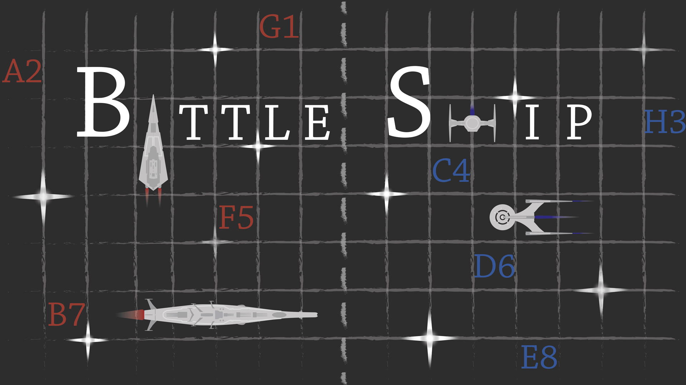

# Battleship

Battleship is a desktop application written in [Java](https://www.oracle.com/java/), using [JavaFX](https://openjfx.io/) to create the GUI. The custom JavaDoc documentation for all classes can be found <a href="https://htmlpreview.github.io/?https://github.com/ElienVissers/Battleship/blob/master/resources/doc/allclasses.html">here</a> (right click to open in a new tab).

## Features

Battleship is a two-player game where both players fight to rule the universe!

Based on the classic battleship boardgame, this game takes place in outer space. Taking turns, players are able to aim and fire lasers to destroy the strategically placed enemy ships. Will you rule the universe? Play and find out!

- You won’t need 2 desktops/laptops to play this game, one is enough!
- You can choose how big the battlefield is and how many ships each player will have in their fleet.
- The purpose is to destroy all the enemy’s spaceships with as little as possible lasers.

## Roadmap

Improvements 

- edit ships after placement (rotate/remove)
- drag & drop to place ships on the board
- key inputs: ENTER to confirm, R to rotate

Future Features

- position your fleet randomly
- battle against a droid

## Run the application

Windows: download [Battleship.jar](out/artifacts/Battleship_jar/Battleship.jar) and run the following command: "java -jar Battleship.jar"

   
   
  

  
